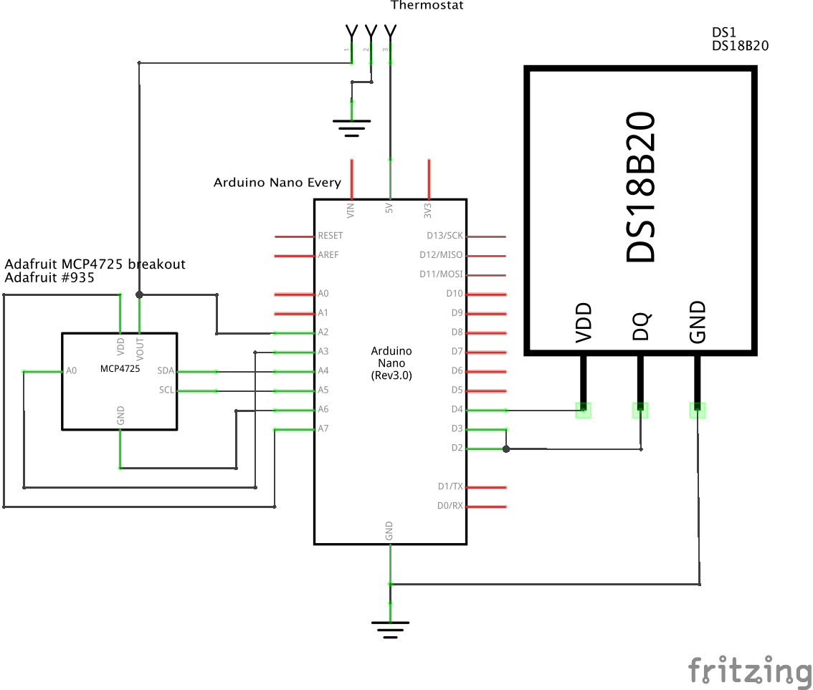

An adapter made to connect my [DS18B20 floor sensor](https://www.adafruit.com/product/381) to my [thermostat](https://www.moeshouse.com/collections/electric-floor-heating-thermostat/products/wifi-white-thermostat-temperature-controller-lcd-touch-screen-backlight-for-electric-heating-works-with-alexa-google-home-16a) that only accepts an NTC 10k as an input. Here the [Arduino](https://www.arduino.cc/en/Guide/NANOEvery) reads out a measurement from the Dallas sensor, converts it into corresponding NTC resistance value and emulates an NTC sensor by setting corresponding voltage level on the thermostat input jumper.

I used an [Adafruit MCP4725 Breakout Board](https://www.adafruit.com/product/935) which I soldered together with the Arduino board like a sandwich. This way I managed to make the assembled device tiny.

Also, I didn't use an external pull-up resistor for DS18B20 and used the built-in one on D3 pin. Data pin D2 is then soldered to D3.

[table.py](table.py) script is used to pre-generate a conversion table from temperature to DAC value.

## Schematic

